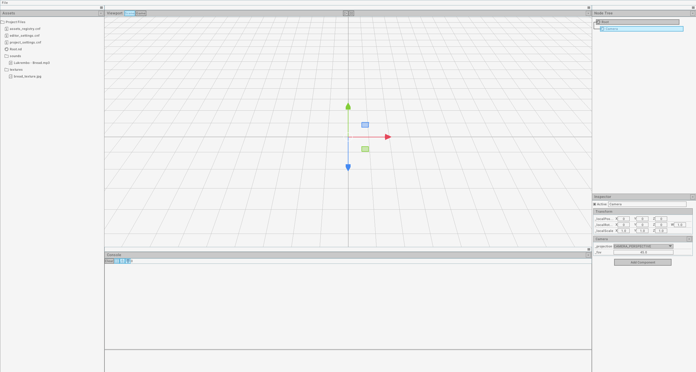

# BreadEngine

A lightweight C++ game engine based on pure C-library 'Raylib' with built-in editor.


## ---WARNING---

!!!!THIS PROJECT IS NOT READY FOR USE AND IS IN ACTIVE DEVELOPMENT!!!!

## Requirements

- CMake 3.4 or higher
- C++23 compatible compiler
- Platform-specific dependencies:
    - **Windows**: MinGW64, GnuWin32

## Build Instructions

### Only Windows for now

1. Install MinGW64 and add to PATH
2. Install GnuWin32 and add to PATH
3. Clone the repository
4. Create build directory:
   ```bash
   mkdir build
   cd build
   ```
5. Configure with CMake:
   ```bash
   cmake ..
   ```
6. Build:
   ```bash
   cmake --build . --config Debug
   ```

## Output

After successful build, executables will be located in:

- `build/bin/BreadEditor.exe` - Editor application
- `build/bin/ExampleGame.exe` - Example game

## Project Structure

- `modules/engine/` - Core engine library
- `modules/editor/` - Editor application
- `games/example_game/` - Example game implementation
- `lib/` - Third-party libraries

## MIT License

Copyright (c) 2025 Tommimod

Permission is hereby granted, free of charge, to any person obtaining a copy
of this software and associated documentation files (the "Software"), to deal
in the Software without restriction, including without limitation the rights
to use, copy, modify, merge, publish, distribute, sublicense, and/or sell
copies of the Software, and to permit persons to whom the Software is
furnished to do so, subject to the following conditions:

The above copyright notice and this permission notice shall be included in all
copies or substantial portions of the Software.

THE SOFTWARE IS PROVIDED "AS IS", WITHOUT WARRANTY OF ANY KIND, EXPRESS OR
IMPLIED, INCLUDING BUT NOT LIMITED TO THE WARRANTIES OF MERCHANTABILITY,
FITNESS FOR A PARTICULAR PURPOSE AND NONINFRINGEMENT. IN NO EVENT SHALL THE
AUTHORS OR COPYRIGHT HOLDERS BE LIABLE FOR ANY CLAIM, DAMAGES OR OTHER
LIABILITY, WHETHER IN AN ACTION OF CONTRACT, TORT OR OTHERWISE, ARISING FROM,
OUT OF OR IN CONNECTION WITH THE SOFTWARE OR THE USE OR OTHER DEALINGS IN THE
SOFTWARE.
